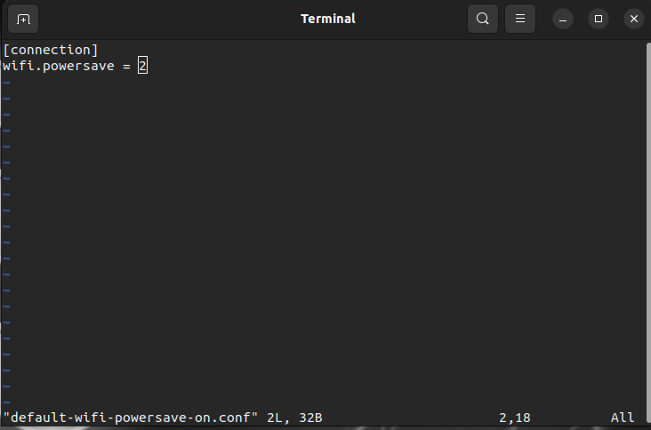
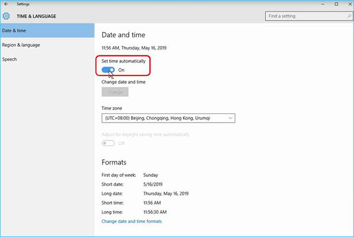

<div align="center">

# Dual Booting Windows 10 & Ubuntu 22.04 in 2023

</div>


## Growing Pains & Resolutions

### 🐢 Slow Wifi in Ubuntu
**Cause:** Ubuntu may set network configurations to power-saving mode, thus throttling wifi

1. Test by going to https://www.speedtest.net/
2. Open Terminal
3. Run the following command
```bash
$ sudo vim /etc/NetworkManager/conf.d/default-wifi-powersave-on.conf
```
4. Set the value of ``wifi.powersave`` to 2.



5. Reboot into Ubuntu
6. Run the speed test again https://www.speedtest.net/

#### wifi.powersave values
- 0: Use default settings
- 1: ignore
- 2: DISABLE power saving **(YOU WANT THIS SETTING)**
- 3: ENABLE power saving

### 🔇 Ubuntu Audio Not Working 
**Cause:** ``pulseaudio`` has not properly started

1. Open Terminal
2. Run the following commands

```bash
$ sudo pulseaudio --kill
$ sudo pulseaudio --start
```
3. Test: https://www.youtube.com/watch?v=eZ2PtEx9-ls

### 🕰️ Wrong Time in Windows
**Cause:** Windows and Linux store their times differently in UEFI firmware, causing clock desynchronization
1. Boot into Ubuntu
2. Open Terminal
3. Run the following commands

```bash
$ sudo timedatectl set-local-rtc 1 --adjust-system-clock
```
4. Reboot into Windows
5. Go to ``Start``  > ``Settings``  > ``Time & language`` > ``Date & time``.
6. Set your timezone if necesarry
7. Disable and renable ``Set time automatically`` in one step

8. Reboot system to Windows
