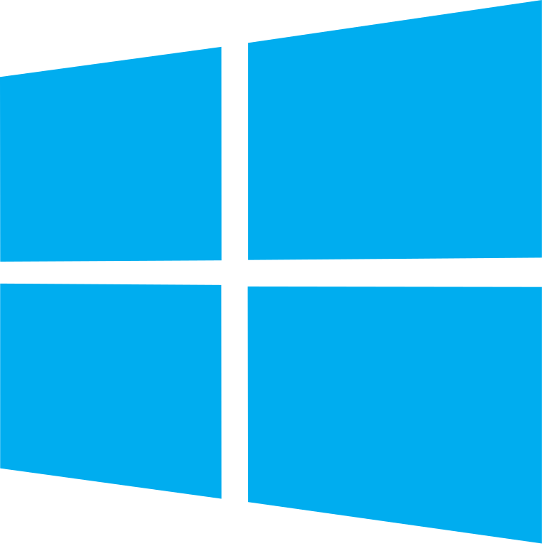
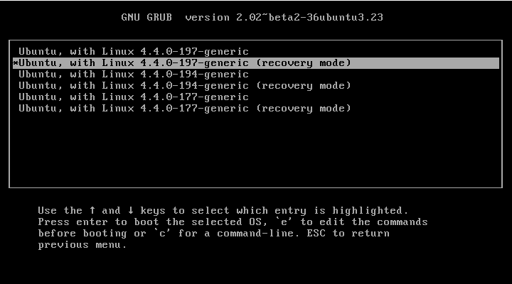

<table>
<tr>
    <td>
        
    </td>
    <td> <h1>Dual Booting Windows 10 & Ubuntu 22.04 in 2023</h1></td>
    <td>
        
    </td>
</tr>

</table>


## Growing Pains & Resolutions

### [Slow Wifi](#slowifi)
### [Audio not Working](#noaudio)
### [Wrong Time in Windows](#wrongtime)
### [Uninstalling Nvidia Drivers](#nvidiadrivers)
### ["Disk is Read Only!"" Error](#readonlydisks)


<div id='slowwifi'>

## 🐢 Slow Wifi in Ubuntu 
**Cause:** Ubuntu may set network configurations to power-saving mode, thus throttling wifi

1. Test by going to https://www.speedtest.net/
2. Open Terminal
3. Run the following command
```bash
$ sudo vim /etc/NetworkManager/conf.d/default-wifi-powersave-on.conf
```
4. Set the value of ``wifi.powersave`` to 2.


5. Reboot into Ubuntu
6. Run the speed test again https://www.speedtest.net/

### wifi.powersave values
- 0: Use default settings
- 1: ignore
- 2: DISABLE power saving **(YOU WANT THIS SETTING)**
- 3: ENABLE power saving

source: https://www.youtube.com/watch?v=N_e82SuiAYc&list=LL&index=1

</div>

<div id="noaudio">

## 🔇 Ubuntu Audio Not Working 
**Cause:** ``pulseaudio`` has not properly started

1. Open Terminal
2. Run the following commands

```bash
$ sudo pulseaudio --kill
$ sudo pulseaudio --start
```
3. Test: https://www.youtube.com/watch?v=eZ2PtEx9-ls


<div id="wrongtime">

## 🕰️ Wrong Time in Windows
**Cause:** Windows and Linux store their times differently in UEFI firmware, causing clock desynchronization
1. Boot into Ubuntu
2. Open Terminal
3. Run the following commands

```bash
$ sudo timedatectl set-local-rtc 1 --adjust-system-clock
```
4. Reboot into Windows
5. Go to ``Start``  > ``Settings``  > ``Time & language`` > ``Date & time``.
6. Set your timezone if necesarry
7. Disable and renable ``Set time automatically`` in one step

8. Reboot system to Windows

source: https://www.youtube.com/watch?v=A70s-C-yWTQ&list=LL&index=4

</div>

<div id="nvidiadrivers">

## 🖥️ Uninstalling Nvidia Drivers

**Cause:** You might be installing an Nvidia driver from the wrong source, but after rebooting, you get greeted by a black screen of death

1. Boot your system in recovery mode by selecting ``Advanced options for Ubuntu``


2. Select the first option that lists ``(recovery mode)``



3. Select ``resume``


4. Once you arrive to your desktop, open your terminal and use these commands.

```bash
$ dpkg -l | grep -i nvidia 
$ sudo apt-get remove --purge '^nvidia-.*' 
$ sudo apt-get install ubuntu-desktop 
$ echo 'nouveau' | sudo tee -a /etc/modules
```

5. Reboot your system

source: https://askubuntu.com/questions/206283/how-can-i-uninstall-a-nvidia-driver-completely

</div>

<div id="readonlydisks">

## 🚫 "Disk is Read Only!"" Error

**Cause:** Windows and Linux both have access to the same drive, causing a multiple ownership problem. To preserve intergity, Linux refueses to modify the drive, thus creating the error

1. Boot into Windows
2. Press ``Win-Key`` + ``R``, type ``powercfg.cpl`` and press ``Enter``
    - The 'power options' screen should pop up
3. Click on ``Choose what the power button does``


4. Click on ``Change settings that are currently unavailable``


5. Uncheck the ``Turn of fast startup (recommended)`` option


6. Reboot into Ubuntu

source: https://www.youtube.com/watch?v=CdLcJLKEMbY

</div>